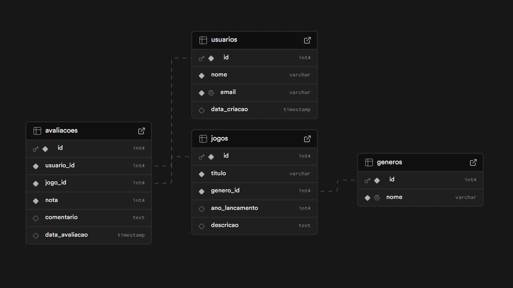
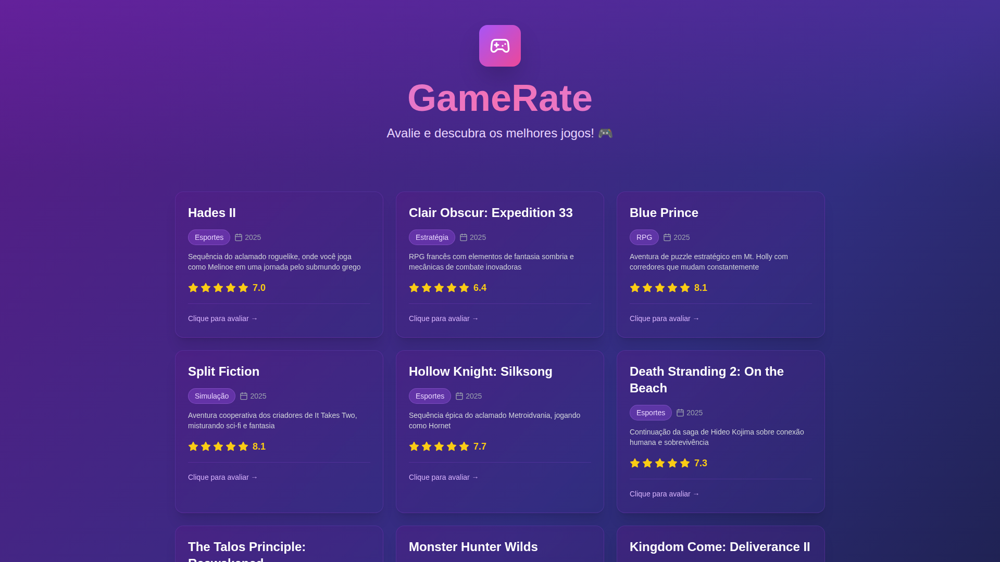
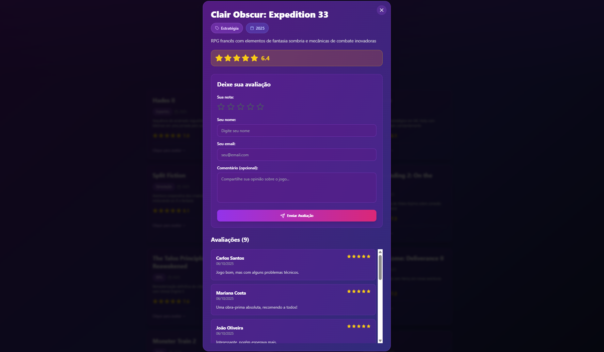

# 🎮 PlaysScore

## 📖 Descrição do Projeto
O **Playscore** é uma aplicação web que permite aos usuários consultar uma lista de jogos, visualizar suas médias de avaliação e deixar suas próprias notas e comentários.  
O objetivo do projeto é oferecer uma plataforma interativa e simples para registrar e comparar opiniões sobre diversos títulos de jogos eletrônicos.

Na página principal, os jogos são exibidos em **cards**, mostrando:
- **Título do jogo**
- **Gênero**
- **Média de notas representada por estrelas**

Ao clicar em um jogo, o usuário é levado a uma tela com:
- Um **formulário de avaliação**, onde pode inserir sua nota e comentário.  
- Uma seção com **avaliações de outros usuários**.  
- As **informações completas do jogo**, incluindo descrição e ano de lançamento.

---

## 🧩 Modelo Lógico do Banco de Dados

O sistema utiliza o seguinte modelo lógico, que representa as relações entre **usuários**, **gêneros**, **jogos** e **avaliações**:

### Estrutura das Tabelas

#### Usuários (`usuarios`)
| Campo | Tipo | Descrição |
|--------|------|-----------|
| id | INT | Identificador único do usuário |
| nome | VARCHAR | Nome do usuário |
| email | VARCHAR | E-mail do usuário |
| data_criacao | DATE | Data de criação da conta |

#### Gêneros (`generos`)
| Campo | Tipo | Descrição |
|--------|------|-----------|
| id | INT | Identificador único do gênero |
| nome | VARCHAR | Nome do gênero do jogo |

#### Jogos (`jogos`)
| Campo | Tipo | Descrição |
|--------|------|-----------|
| id | INT | Identificador único do jogo |
| titulo | VARCHAR | Título do jogo |
| genero_id | INT (FK) | Referência para o gênero do jogo |
| ano_lancamento | INT | Ano de lançamento |
| descricao | TEXT | Descrição do jogo |

#### Avaliações (`avaliacoes`)
| Campo | Tipo | Descrição |
|--------|------|-----------|
| id | INT | Identificador único da avaliação |
| usuario_id | INT (FK) | Referência para o usuário |
| jogo_id | INT (FK) | Referência para o jogo |
| nota | INT | Nota dada ao jogo (1 a 5) |
| comentario | TEXT | Comentário do usuário |
| data_avaliacao | DATE | Data da avaliação |

---

## 🖼️ Prints da Aplicação

### Página Inicial

### Tela de Avaliação

---

## 🌐 Link do Site Publicado (Deploy)

🔗 **Acesse o sistema aqui:** [PlayScore](https://57903eee-40c7-4bb0-948a-b1e394e59fd7.dev33.app-preview.com/)
